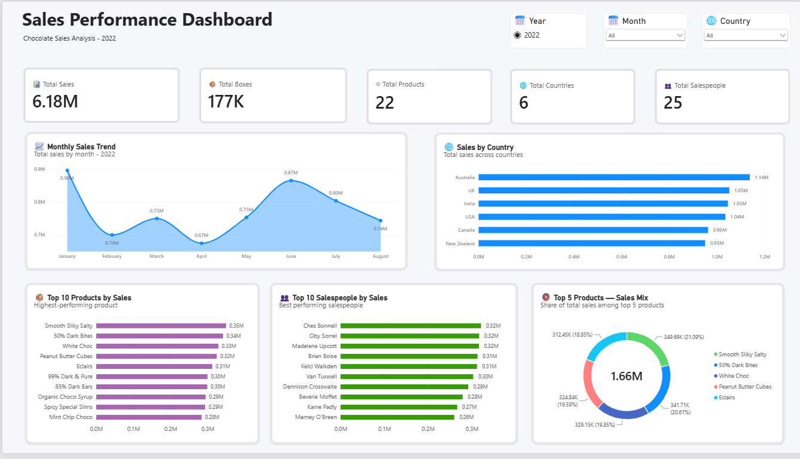

# 🍫 Sales Data Analysis & Power BI Dashboard

An end-to-end **Data Analyst portfolio project** using **MySQL 8.0, SQL, Excel/CSV, and Power BI** to analyze chocolate sales data and build an interactive business dashboard.

### 🔄 Project Workflow

**Excel/CSV → MySQL → SQL Data Cleaning & Analysis → Power BI → Interactive Dashboard**

---

## 🛠️ Tools Used

- **MySQL 8.0**
- **SQL**
- **Power BI Desktop**
- **Microsoft Excel**
- **CSV**
- **Git & GitHub**

---

## 🧠 Skills Demonstrated

### SQL

- Data loading and cleaning
- Data validation
- Date transformation
- Currency and numeric transformation
- Aggregate functions
- `GROUP BY`
- `ORDER BY`
- Window functions
- Month-over-Month analysis
- Sales efficiency analysis
- SQL Views

### Power BI

- MySQL data connection
- KPI Cards
- Line/Area Charts
- Horizontal Bar Charts
- Donut Charts
- Top-N analysis
- Interactive slicers
- Cross-filtering
- Dashboard formatting
- Data visualization

### Data Analysis

- Monthly sales trend analysis
- Country performance analysis
- Product performance analysis
- Salesperson performance analysis
- Sales-per-box efficiency
- Business insights

---

# 📊 Dataset

The dataset contains **1,094 sales transactions** covering **January 2022 to August 2022**.

| Metric | Value |
|---|---:|
| Sales Records | 1,094 |
| Total Sales | $6.18M |
| Boxes Shipped | 177,007 |
| Products | 22 |
| Countries | 6 |
| Salespeople | 25 |
| Period | Jan–Aug 2022 |

### Dataset Columns

| Column | Description |
|---|---|
| `Sales_Person` | Salesperson responsible for the transaction |
| `Country` | Country/market |
| `Product` | Chocolate product |
| `Date` | Transaction date |
| `Amount` | Sales amount |
| `Boxes_Shipped` | Number of boxes shipped |

---

# 🧹 Data Cleaning

The raw dataset was prepared before analysis.

### Key Cleaning Steps

- Converted text dates into MySQL `DATE` format.
- Removed `$`, commas, and spaces from sales amounts.
- Converted sales amounts to `DECIMAL(12,2)`.
- Converted `Boxes_Shipped` into integer values.
- Checked record counts.
- Checked NULL values.
- Validated the date range.
- Created an analytical SQL view for Power BI.

### Analytical View

```sql
CREATE OR REPLACE VIEW sales_analysis_view AS
SELECT
    Sales_Person,
    Country,
    Product,
    Date,
    YEAR(Date) AS Year,
    MONTH(Date) AS Month_Number,
    MONTHNAME(Date) AS Month,
    Amount AS Sales,
    Boxes_Shipped,
    ROUND(
        Amount / NULLIF(Boxes_Shipped, 0),
        2
    ) AS Sales_Per_Box
FROM chandoo_sales_data;
```

---

# 💰 Key KPIs

| KPI | Value |
|---|---:|
| Total Sales | $6.18M |
| Total Boxes | 177K |
| Total Products | 22 |
| Total Countries | 6 |
| Total Salespeople | 25 |

---

# 📈 Monthly Sales Analysis

| Month | Sales | MoM Change |
|---|---:|---:|
| January | $896,105 | — |
| February | $699,377 | -21.95% |
| March | $749,483 | +7.16% |
| April | $674,051 | -10.06% |
| May | $752,892 | +11.70% |
| June | $865,144 | +14.91% |
| July | $803,425 | -7.13% |
| August | $743,148 | -7.50% |

### Insight

January recorded the highest monthly sales at approximately **$896K**.

June also performed strongly with approximately **$865K** in sales and recorded the highest positive month-over-month growth of **14.91%**.

---

# 🌍 Sales by Country

| Rank | Country | Sales |
|---:|---|---:|
| 1 | Australia | $1,137,367 |
| 2 | UK | $1,051,792 |
| 3 | India | $1,045,800 |
| 4 | USA | $1,035,349 |
| 5 | Canada | $962,899 |
| 6 | New Zealand | $950,418 |

### Insight

**Australia** generated the highest sales among the six countries, with approximately **$1.14M**.

---

# 🍫 Top 10 Products by Sales

| Rank | Product | Sales |
|---:|---|---:|
| 1 | Smooth Sliky Salty | $349,692 |
| 2 | 50% Dark Bites | $341,712 |
| 3 | White Choc | $329,147 |
| 4 | Peanut Butter Cubes | $324,842 |
| 5 | Eclairs | $312,445 |
| 6 | 99% Dark & Pure | $299,796 |
| 7 | 85% Dark Bars | $299,229 |
| 8 | Organic Choco Syrup | $294,700 |
| 9 | Spicy Special Slims | $293,454 |
| 10 | Mint Chip Choco | $283,969 |

### Insight

**Smooth Sliky Salty** was the highest-selling product, generating approximately **$349.7K**.

---

# 📦 Sales-per-Box Analysis

### Formula

```text
Sales per Box = Total Sales / Total Boxes Shipped
```

### Key Findings

- **Almond Choco** had the highest sales per box at approximately **$41.20**.
- **White Choc** generated approximately **$39.95 per box**.
- **70% Dark Bites** had the lowest sales per box at approximately **$26.40**.
- **Rafaelita Blaksland** achieved the highest salesperson sales-per-box efficiency at approximately **$48.93**.

This analysis helps distinguish **sales volume from sales efficiency**.

---

# 👥 Salesperson Analysis

## Top 10 Salespeople by Sales

| Rank | Salesperson | Sales |
|---:|---|---:|
| 1 | Ches Bonnell | $320,901 |
| 2 | Oby Sorrel | $316,645 |
| 3 | Madelene Upcott | $316,099 |
| 4 | Brien Boise | $312,816 |
| 5 | Kelci Walkden | $311,710 |
| 6 | Van Tuxwell | $303,149 |
| 7 | Dennison Crosswaite | $291,669 |
| 8 | Beverie Moffet | $278,922 |
| 9 | Kaine Padly | $266,490 |
| 10 | Marney O'Breen | $259,742 |

### Additional Findings

- **Ches Bonnell** generated the highest total sales at approximately **$320.9K**.
- **Karlen McCaffrey** shipped the most boxes with **9,658 boxes**.
- **Madelene Upcott** had the highest average sales per transaction at approximately **$7,024.42**.
- **Rafaelita Blaksland** had the highest sales-per-box efficiency.

---

# 📊 Power BI Dashboard

The final dashboard was created in **Power BI Desktop** using the MySQL analytical view.

## KPI Cards

- 📊 Total Sales
- 📦 Total Boxes
- ◇ Total Products
- 🌐 Total Countries
- 👥 Total Salespeople

## Visualizations

- 📈 Monthly Sales Trend
- 🌐 Sales by Country
- 📦 Top 10 Products by Sales
- 👥 Top 10 Salespeople by Sales
- 🍩 Top 5 Products — Sales Mix

## Interactive Filters

- Year
- Month
- Country

The slicers dynamically filter the dashboard visuals.

---

# 🖼️ Dashboard Preview



---

# ❓ Business Questions Answered

1. What is the total sales generated?
2. How do sales change month over month?
3. Which month generated the highest sales?
4. Which countries generate the highest sales?
5. What are the top 10 products by sales?
6. Which products have the highest sales per box?
7. Who are the top 10 salespeople by sales?
8. Who has the highest sales-per-box efficiency?
9. How many products are represented?
10. How many countries are represented?
11. How many salespeople are represented?
12. How does performance change when filtering by month or country?

---

# 🔎 Key SQL Queries

## Total Sales

```sql
SELECT
    ROUND(SUM(Amount), 2) AS Total_Sales
FROM chandoo_sales_data;
```

## Sales by Country

```sql
SELECT
    Country,
    ROUND(SUM(Amount), 2) AS Total_Sales
FROM chandoo_sales_data
GROUP BY Country
ORDER BY Total_Sales DESC;
```

## Monthly Sales

```sql
SELECT
    YEAR(Date) AS Year,
    MONTH(Date) AS Month_Number,
    MONTHNAME(Date) AS Month,
    ROUND(SUM(Amount), 2) AS Total_Sales
FROM chandoo_sales_data
GROUP BY
    YEAR(Date),
    MONTH(Date),
    MONTHNAME(Date)
ORDER BY
    Year,
    Month_Number;
```

## Top 10 Products

```sql
SELECT
    Product,
    ROUND(SUM(Amount), 2) AS Total_Sales
FROM chandoo_sales_data
GROUP BY Product
ORDER BY Total_Sales DESC
LIMIT 10;
```

## Top 10 Salespeople

```sql
SELECT
    Sales_Person,
    ROUND(SUM(Amount), 2) AS Total_Sales
FROM chandoo_sales_data
GROUP BY Sales_Person
ORDER BY Total_Sales DESC
LIMIT 10;
```

## Sales per Box

```sql
SELECT
    Product,
    ROUND(
        SUM(Amount) / NULLIF(SUM(Boxes_Shipped), 0),
        2
    ) AS Sales_Per_Box
FROM chandoo_sales_data
GROUP BY Product
ORDER BY Sales_Per_Box DESC;
```

---

# 💡 Business Insights

### 1. Strong Overall Performance

The business generated approximately **$6.18M** in sales during the eight-month period.

### 2. Monthly Fluctuations

Sales varied throughout the period, with February showing the largest decline and June showing strong recovery.

### 3. Australia Leads the Markets

Australia generated approximately **$1.14M**, making it the highest-performing country.

### 4. Product Performance

**Smooth Sliky Salty** was the highest-selling product by revenue.

### 5. Volume vs Efficiency

The salesperson shipping the most boxes is not necessarily the salesperson with the highest sales-per-box efficiency.

---

# 📁 Repository Structure

```text
Sales-Data-SQL-PowerBI/
│
├── README.md
│
├── Data/
│   ├── sample-data-10mins.xlsx
│   └── chandoo_sales_data.csv
│
├── SQL/
│   └── sales_analysis.sql
│
├── PowerBI/
│   └── Sales_Performance_Dashboard.pbix
│
└── Screenshots/
    └── dashboard.png
```

---

# 🚀 How to Reproduce

### 1. Clone the Repository

```bash
git clone https://github.com/ankita-singhhh/Sales-Data-SQL-PowerBI.git
cd Sales-Data-SQL-PowerBI
```

### 2. Create the Database

```sql
CREATE DATABASE sales_analysis;

USE sales_analysis;
```

### 3. Create the Table

```sql
CREATE TABLE chandoo_sales_data (
    Sales_Person VARCHAR(100),
    Country VARCHAR(50),
    Product VARCHAR(100),
    Date DATE,
    Amount DECIMAL(12,2),
    Boxes_Shipped INT
);
```

### 4. Load the Dataset

Use the CSV file from the `Data` folder to load the data into MySQL.

### 5. Run SQL Analysis

Open:

```text
SQL/sales_analysis.sql
```

Run the required SQL queries for data validation, analysis, and the Power BI analytical view.

### 6. Connect Power BI

Open:

```text
PowerBI/Sales_Performance_Dashboard.pbix
```

Connect Power BI to:

```text
Server: localhost:3306
Database: sales_analysis
```

Use:

```text
sales_analysis_view
```

as the main analytical data source.

---

# 🔗 Project Links

- **GitHub Repository:**  
  https://github.com/ankita-singhhh/Sales-Data-SQL-PowerBI

- **SQL Analysis:**  
  [SQL Folder](SQL/)

- **Power BI Dashboard:**  
  [PowerBI Folder](PowerBI/)

- **Dataset:**  
  [Data Folder](Data/)

- **Dashboard Screenshot:**  
  [Screenshots Folder](Screenshots/)

---

# 🎯 Conclusion

This project demonstrates an end-to-end **Data Analyst workflow**:

**Raw Data → Data Cleaning → SQL Analysis → Power BI Visualization → Interactive Dashboard → Business Insights**

The project demonstrates practical skills in:

- SQL
- MySQL
- Data Cleaning
- Exploratory Data Analysis
- KPI Development
- Power BI
- Data Visualization
- Business Intelligence
- Business-oriented Reporting

---
